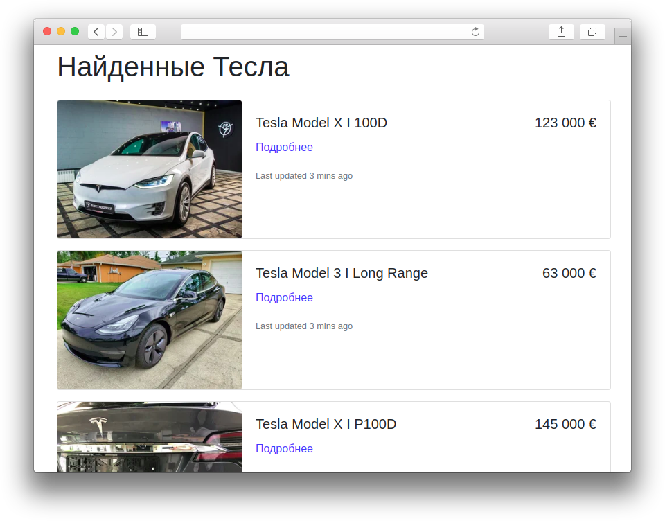

#  Tesla

Программа собирает объявления о продаже автомобилей Tesla в интернете и размещает их на своей странице:



## Как установить

Установите Python пакеты из `requirements.txt`:

```bash
pip install -r requirements.txt
```

Запустите скрипты сбора объявлений для каждого из сайтов [auto.ru](https://auto.ru) и [autotrader.co.uk](https://www.autotrader.co.uk):

```bash
mkdir -p data
scrapy runspider auto_ru.py -L WARNING --output=data/auto_ru.json
scrapy runspider autotrader_co_uk.py -L WARNING --output=data/autotrader_co_uk.json
```

Результаты парсинга сохранятся в `*.json` файлы внутри каталога `data`. При повторном запуске парсер добавит новые данные в конец файла и этим сломает JSON, поэтому старые файлы с данными лучше удалять перед повторным запуском.

На основе JSON файлов можно сгенерировать HTML страничку с названиями, ценами и фотографиями автомобилей. Запустите ещё один скрипт `render.py`:

```bash
python render.py
```

Скрипт создаст файл index.html или обновит его, если такой уже существует. Откройте файл index.html в браузере.

## TODO

Что еще стоит реализовать:

- Добавить поддержку пагинации для autotrader.co.uk
- Указать в списке объявлений регион — из какой страны забирать авто
- Отказаться от хранения данных в файлах, сразу обновлять HTML
- Указать в списке объявлений дату загрузки объявлений
- Подключить еще парочку сайтов — один французский и один немецкий


# 30 Дней кода

Скрипт для генерации чеклиста — отмечайте в нём каждый свой коммит, следите за прогрессом.
